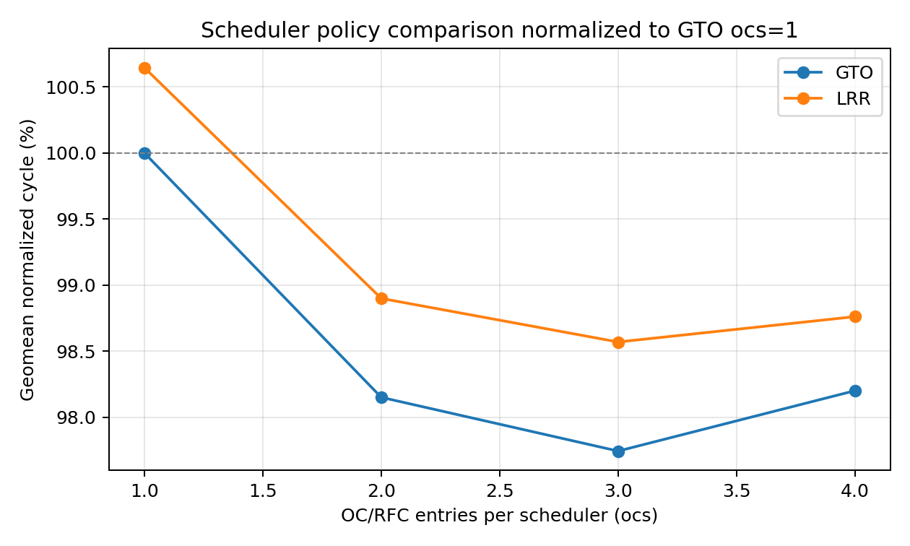
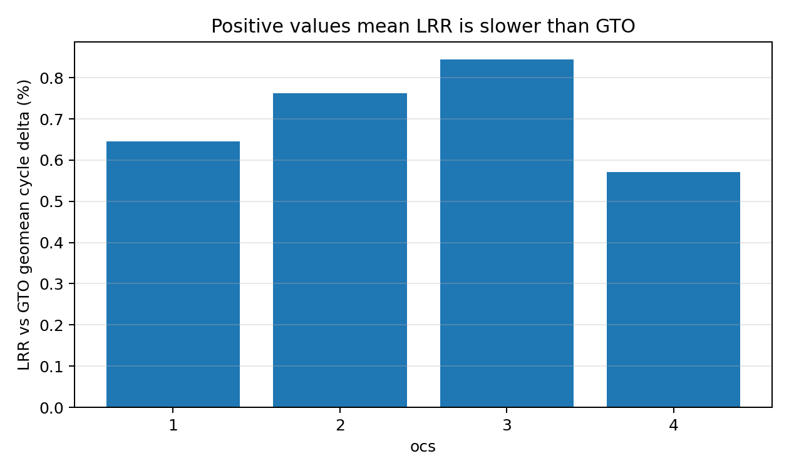
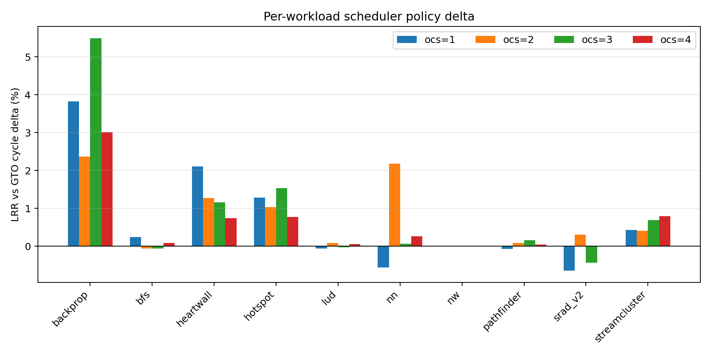
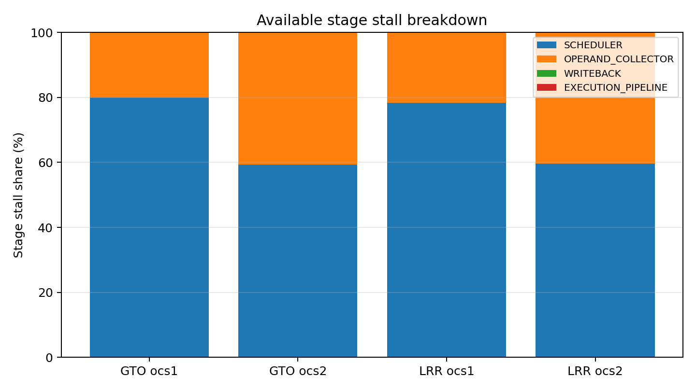
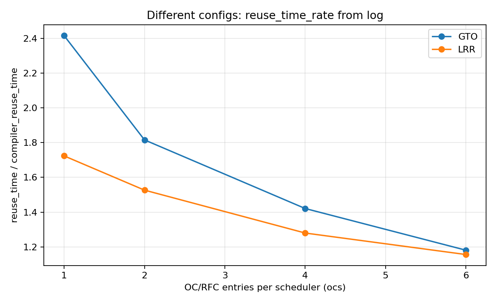
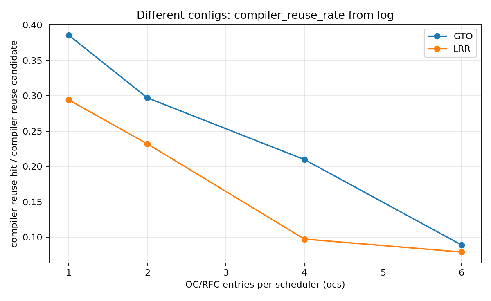
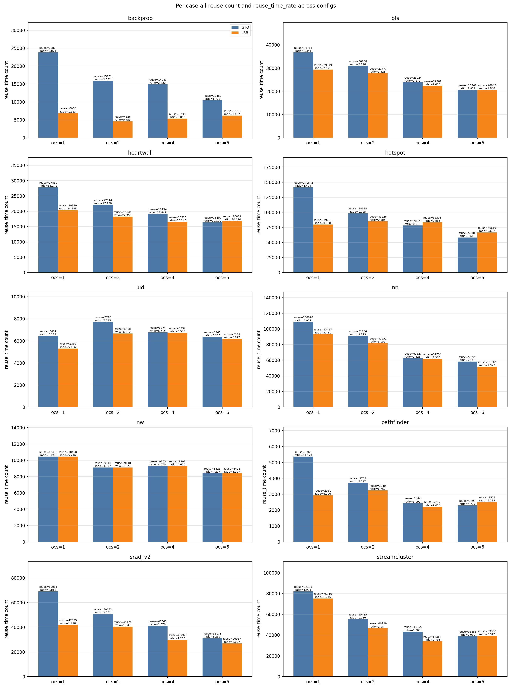
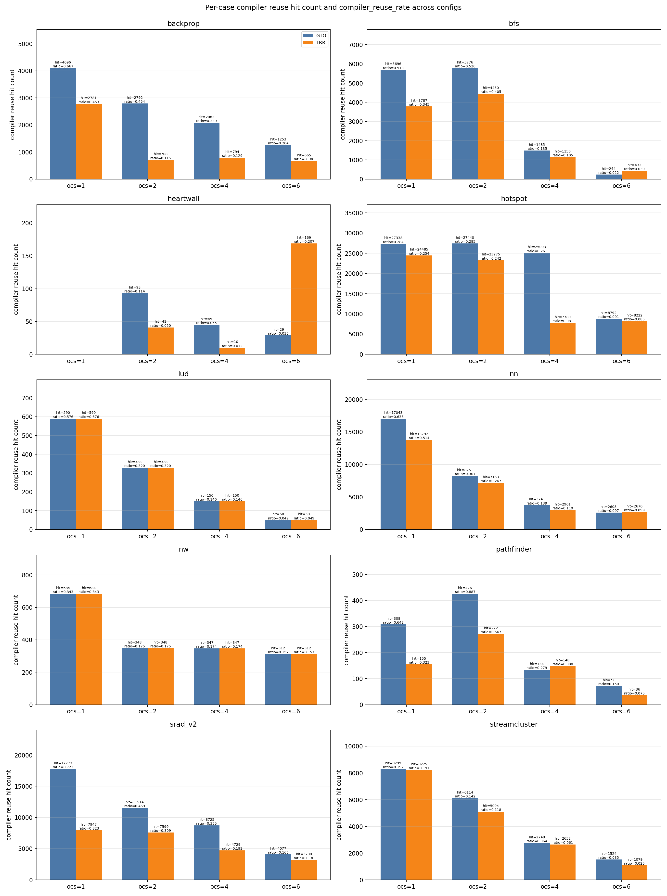

# GPU Warp Scheduler 与 RFC Reuse 策略实验分析

## 摘要

本文面向 Accel-Sim/GPGPU-Sim 中 RFC 风格 operand-read buffer 的优化问题，设计两组实验：第一组比较 GTO 与 LRR 两种 warp scheduling policy 在不同 RFC/OC entry 数量下的性能差异，第二组比较全量 reuse 与编译器指导 reuse 在不同 scheduler 和 RFC/OC entry 数量下的 reuse 行为差异。

调度策略实验固定 `rfc=1, bank=2, wbd=1, reuse=0, regb=8, ocu=8, dp=4`，扫描 `sched={gto,lrr}` 与 `ocs={1,2,3,4}`。结果显示，在 10 个 Rodinia workload 的几何平均周期上，GTO 在全部 `ocs` 配置下均略优于 LRR；LRR 相对 GTO 的几何平均周期增加约 0.57%–0.84%。从最佳配置看，10 个 workload 中有 7 个在 GTO 下取得最优周期，2 个在 LRR 下取得最优周期，1 个两种策略相同。该结果表明，GTO 更适合作为 RFC reuse 策略实验的默认调度策略。

reuse 实验进一步表明，GTO 不仅在总周期上更优，也产生了更高的 reuse 机会和 compiler-guided reuse hit rate。在相同 `ocs` 下，GTO 的 `reuse_time_rate` 和 `rfc_compiler_reuse_rate` 均高于 LRR；例如 `ocs=1` 时，GTO 的全量 reuse 机会为 512,713 次、`reuse_time_rate=2.415`，而 LRR 为 365,903 次、`reuse_time_rate=1.724`。同时，全量 reuse 可覆盖的 reuse 机会显著多于编译器指导 reuse 的实际命中：`ocs=1` 下 GTO 的全量 reuse 机会是 compiler reuse candidate 的 2.42 倍，而 compiler-guided reuse hit 只占 candidate 的 38.54%。这说明在当前统计口径和 workload 集合下，编译器 reuse hint 的选择较保守，实际命中覆盖不足；全量 reuse 暴露出更多可复用机会。随着 `ocs` 从 1 增加到 6，reuse 次数和 hit rate 均下降，说明 RFC/OC entry 数量会显著改变 reuse 行为：更大的 `ocs` 会改变指令进入 RFC/OC 的时序和驻留关系，使短期可命中的 reuse 机会减少。

**关键词**：Accel-Sim，GPGPU-Sim，GTO，LRR，warp scheduler，RFC，operand reuse，Rodinia

---

## 1. 实验设计

### 1.1 研究目标

RFC/OC 容量实验表明，增加 RFC entry 能缓解小容量下的 entry allocation bottleneck，但很快会把等待转移到下游执行或 memory path。调度策略会影响哪些 warp 更早进入 RFC/OC，也会影响 operand reuse、memory-level parallelism、warp 间公平性和下游资源压力。因此，在继续研究 RFC reuse 策略前，需要先确定一个更合适的 scheduler baseline。

本文包含两组实验：

1. **调度策略实验**：比较 GTO 与 LRR 在不同 `ocs` 下的性能，判断后续实验应采用哪种 scheduler policy。
2. **RFC reuse 策略实验**：比较全量 reuse 与编译器指导 reuse 的机会数量、命中数量和命中率，并分析 scheduler policy 与 `ocs` 数量对 reuse 行为的影响。

### 1.2 实验配置与派生数据

本文不依赖原始 Accel-Sim 回归目录进行展示。原始日志、trace 和中间统计体积较大，不适合随报告上传；因此报告只保留支撑结论所需的派生 CSV 和图片。派生 CSV 位于同层目录 `csv/`，图片位于同层目录 `graph/`。

调度策略对比实验配置如下：

```text
sched = {gto, lrr}
ocs   = {1, 2, 3, 4}
rfc   = 1
bank  = 2
wbd   = 1
reuse = 0
regb  = 8
ocu   = 8
dp    = 4
```

reuse 统计实验配置如下：

```text
sched = {gto, lrr}
ocs   = {1, 2, 4, 6}
rfc   = 1
bank  = 2
wbd   = 1
reuse = 0
regb  = 8
ocu   = 8
dp    = 4
```

其中 `reuse=0` 表示模拟器配置不启用额外手工 reuse 策略；日志中的 `reuse_time`、`rfc_compiler_reuse_time` 和 `rfc_compiler_reuse_hit_time` 是额外统计项，用来比较全量 reuse 机会与编译器指导 reuse 的 candidate/hit 行为。

当前报告使用的派生数据包括：

| 文件 | 内容 |
|---|---|
| `csv/gto_lrr_total_cycles.csv` | GTO/LRR × `ocs=1..4` 的 workload 总周期 |
| `csv/gto_lrr_geomean_summary.csv` | 相同 `ocs` 下 LRR 相对 GTO 的几何平均周期差异 |
| `csv/scheduler_ocs_geomean.csv` | 不同 scheduler/ocs 相对 `GTO ocs=1` 的几何平均归一化周期 |
| `csv/lrr_vs_gto_by_case.csv` | 各 workload 中 LRR 相对 GTO 的周期变化 |
| `csv/best_scheduler_ocs_by_case.csv` | 各 workload 的最优 scheduler/ocs 组合 |
| `csv/available_stage_stall_pct.csv` | 可用配置下的 stage-level stall 占比 |
| `csv/available_stage_remain_pct.csv` | 可用配置下的 stage-level remain 占比 |
| `csv/available_oc_stall_by_op.csv` | 可用配置下按 op 聚合的 OC stall |
| `csv/available_oc_remain_by_op.csv` | 可用配置下按 op 聚合的 OC remain |
| `csv/reuse_stats_by_case_config.csv` | 每个 workload/config 的原始 reuse 统计 |
| `csv/reuse_summary_by_sched_ocs.csv` | 按 scheduler/ocs 聚合的 reuse 统计 |
| `csv/reuse_summary_by_case_sched_ocs.csv` | 按 workload/scheduler/ocs 聚合的 reuse 统计 |

需要说明的是，当前总周期数据覆盖完整的 `GTO/LRR × ocs=1..4`。stage-level 和 op-level 明细数据覆盖 GTO `ocs=1..4`、LRR `ocs=1..3`，因此本文对“谁更快”的判断以完整总周期数据为准，对“为什么更快”的解释主要基于可用 stage/op 明细和 workload 行为进行归因。

---

## 2. GTO 与 LRR 的总体性能对比

### 2.1 几何平均周期

以 `GTO ocs=1` 作为归一化基线，不同 scheduler/ocs 的几何平均周期如下：

| scheduler | ocs1 | ocs2 | ocs3 | ocs4 |
|---|---:|---:|---:|---:|
| GTO | 100.00% | 98.15% | 97.75% | 98.20% |
| LRR | 100.65% | 98.90% | 98.57% | 98.76% |



两个现象比较明显。第一，增加 `ocs` 后，两种调度策略都能从 `ocs=1` 获得一定改善，说明 RFC/OC entry 数量增加能够缓解小容量下的 entry allocation pressure。第二，在相同 `ocs` 下，GTO 的几何平均周期始终低于 LRR。GTO 的最优点为 `ocs=3`，归一化周期为 97.75%；LRR 的最优点同样为 `ocs=3`，但归一化周期为 98.57%。

直接比较相同 `ocs` 下 LRR 相对 GTO 的几何平均周期差异：

| ocs | LRR vs GTO geomean cycle delta | LRR 更优 workload 数 | GTO 更优 workload 数 | 相同 workload 数 |
|---:|---:|---:|---:|---:|
| 1 | +0.65% | 4 | 5 | 1 |
| 2 | +0.76% | 1 | 8 | 1 |
| 3 | +0.84% | 3 | 6 | 1 |
| 4 | +0.57% | 1 | 8 | 1 |



正值表示 LRR 更慢。可以看到，GTO 的优势幅度不大，但在全部 `ocs` 上保持一致。因此，从几何平均性能看，GTO 是更稳健的 scheduler baseline。

### 2.2 Per-workload 差异

完整总周期数据如下：

| workload | GTO ocs1 | GTO ocs2 | GTO ocs3 | GTO ocs4 | LRR ocs1 | LRR ocs2 | LRR ocs3 | LRR ocs4 |
|---|---:|---:|---:|---:|---:|---:|---:|---:|
| `backprop` | 21,059 | 20,959 | 20,226 | 20,623 | 21,864 | 21,454 | 21,337 | 21,243 |
| `bfs` | 140,128 | 139,576 | 139,417 | 139,391 | 140,470 | 139,493 | 139,337 | 139,502 |
| `heartwall` | 11,133 | 10,517 | 10,610 | 10,637 | 11,367 | 10,651 | 10,733 | 10,716 |
| `hotspot` | 98,737 | 97,802 | 97,244 | 98,455 | 100,008 | 98,808 | 98,733 | 99,212 |
| `lud` | 171,470 | 166,561 | 166,364 | 166,144 | 171,359 | 166,705 | 166,306 | 166,239 |
| `nn` | 33,075 | 31,464 | 31,642 | 31,892 | 32,891 | 32,148 | 31,663 | 31,974 |
| `nw` | 141,432 | 139,333 | 138,789 | 138,611 | 141,432 | 139,333 | 138,789 | 138,611 |
| `pathfinder` | 35,364 | 35,018 | 34,909 | 34,999 | 35,337 | 35,048 | 34,965 | 35,014 |
| `srad_v2` | 36,203 | 35,819 | 35,663 | 35,537 | 35,969 | 35,928 | 35,508 | 35,535 |
| `streamcluster` | 1,117,128 | 1,120,514 | 1,119,500 | 1,128,674 | 1,121,911 | 1,125,056 | 1,127,237 | 1,137,612 |



从每个 workload 的最优配置看：

| workload | best scheduler | best ocs | best cycle | 相对 GTO ocs1 |
|---|---|---:|---:|---:|
| `backprop` | GTO | 3 | 20,226 | -3.96% |
| `bfs` | LRR | 3 | 139,337 | -0.56% |
| `heartwall` | GTO | 2 | 10,517 | -5.53% |
| `hotspot` | GTO | 3 | 97,244 | -1.51% |
| `lud` | GTO | 4 | 166,144 | -3.11% |
| `nn` | GTO | 2 | 31,464 | -4.87% |
| `nw` | GTO/LRR | 4 | 138,611 | -1.99% |
| `pathfinder` | GTO | 3 | 34,909 | -1.29% |
| `srad_v2` | LRR | 3 | 35,508 | -1.92% |
| `streamcluster` | GTO | 1 | 1,117,128 | 0.00% |

10 个 workload 中，GTO 在 7 个 workload 上取得最优结果，LRR 在 2 个 workload 上取得最优结果，`nw` 两者相同。该结果支持将 GTO 作为后续 reuse 策略实验的默认调度策略。

---

## 3. 为什么 GTO 略优于 LRR

### 3.1 Stage-level stall 分布

在可用的 stage-level 数据中，GTO 与 LRR 的 stall 分布非常接近。以可同时比较的 `ocs=1` 和 `ocs=2` 为例：

| scheduler | ocs | SCHEDULER | OPERAND_COLLECTOR | WRITEBACK |
|---|---:|---:|---:|---:|
| GTO | 1 | 80.02% | 19.97% | 0.01% |
| LRR | 1 | 78.39% | 21.60% | 0.01% |
| GTO | 2 | 59.29% | 40.68% | 0.03% |
| LRR | 2 | 59.64% | 40.34% | 0.02% |



两种 scheduler 的 stage-level stall 分布差异很小，说明 GTO 的优势不是来自简单地把 stall 从某个 stage 大幅消除。更合理的解释是，GTO 改变了 warp 执行顺序，使得某些 warp 能更连续地执行，从而改善短期局部性或减少调度切换带来的局部等待。

### 3.2 GTO 的优势来源

GTO 的核心特征是倾向于继续调度已经取得进展的 warp，直到该 warp 因长延迟事件被阻塞。这种策略可能带来三个好处：

1. **更强的短期局部性**。连续执行同一 warp 可能提高 operand reuse、cache locality 或局部 memory access 聚集度。即使当前实验设置为 `reuse=0`，连续 warp 执行仍可能通过 cache/memory path 或 scoreboard 行为体现收益。
2. **更少的 warp 间切换扰动**。LRR 更强调公平轮转，会更频繁地在不同 warp 之间切换。对于存在阶段性局部计算或短 burst memory access 的 workload，频繁切换可能削弱局部性。
3. **更快推进关键 warp**。在部分 workload 中，持续推进少数 ready warp 能更快释放依赖链，使后续指令更早进入 pipeline。

这些机制可以解释为什么 GTO 在 `backprop`、`heartwall`、`hotspot`、`nn` 和 `streamcluster` 上整体更稳。尤其是 `backprop` 和 `hotspot` 这类对执行流水或操作类型分布更敏感的 workload，GTO 可能通过连续推进 ready warp 减少依赖链上的等待。

### 3.3 LRR 表现较好的场景

LRR 并非在所有 workload 中都更差。`bfs` 和 `srad_v2` 的最优配置分别出现在 `LRR ocs=3`，说明轮转调度在部分 workload 上仍有优势。

LRR 的潜在优势包括：

1. **更好的 warp 间公平性**。对于访存分布较分散、控制流或依赖链较不稳定的 workload，公平轮转可能避免少数 warp 长时间占用调度机会。
2. **更平滑的 memory-level parallelism**。如果 workload 受 memory latency 影响较大，LRR 可能让更多 warp 更均匀地发起 memory request，从而提高 latency hiding 能力。
3. **降低局部资源聚集压力**。GTO 连续推进同一 warp 可能在某些情况下集中制造同类资源压力，而 LRR 的轮转行为可能将压力分散到多个 warp。

因此，结论并不是 LRR 无效，而是：在当前 RFC/OC 配置和 Rodinia workload 集合下，GTO 的几何平均表现更好、更稳定，更适合作为后续策略比较的 baseline。

---

## 4. 与 RFC 容量的关系

两种 scheduler 都在 `ocs=2` 或 `ocs=3` 附近达到较好结果，继续增加到 `ocs=4` 后收益不再扩大。GTO 的几何平均周期从 `ocs=1` 的 100.00% 降到 `ocs=2` 的 98.15%，到 `ocs=3` 进一步降到 97.75%，但 `ocs=4` 回升到 98.20%；LRR 从 100.65% 降到 `ocs=2` 的 98.90%，到 `ocs=3` 进一步降到 98.57%，`ocs=4` 回升到 98.76%。

从纯性能角度看，`ocs=3` 在本组 Rodinia 实验中的几何平均周期最低；但从微结构设计角度看，RFC/OC entry 数量不是无成本参数。更大的 `ocs` 意味着更多 operand buffer / tag / valid bit / replacement state / arbitration 逻辑，也可能增加访问能耗和控制复杂度。因此，硬件设计通常不会只追求实验曲线上的最小周期点，而会选择性能收益已经接近饱和、但面积和复杂度更可控的配置。

这也解释了 NVIDIA 风格配置中 `ocs=2` 的合理性：`ocs=2` 已经获得了大部分容量扩展收益，GTO 几何平均周期从 100.00% 降到 98.15%，而继续增加到 `ocs=3` 只额外带来约 0.41 个百分点的几何平均收益。相比这部分边际收益，额外增加 50% 的 RFC/OC entry 可能并不划算。因此，`ocs=2` 更像是综合性能、面积、能耗和实现复杂度后的工程折中，而 `ocs=3` 更适合作为“性能上限附近”的实验参考点。

这与 RFC 容量实验中的结论一致：增加 RFC/OC entry 可以缓解小容量下的 entry allocation pressure，但当下游执行、memory path 或 output path 成为限制后，继续增加 entry 数量不能带来线性收益。Scheduler policy 会影响这一瓶颈迁移过程，但不能单独消除下游资源限制。

---

## 5. RFC Reuse 行为分析

### 5.1 指标定义

reuse 实验统计了三类核心计数：

```text
reuse_time                    : 全量 reuse 口径下可观察到的 reuse/hit 次数
rfc_compiler_reuse_time       : 编译器 reuse hint 指导下尝试进行 reg reuse 的 candidate 次数
rfc_compiler_reuse_hit_time   : 编译器 reuse candidate 中真正 hit 的次数
```

对应两个日志中直接给出的 ratio：

```text
reuse_time_rate          = reuse_time / rfc_compiler_reuse_time
rfc_compiler_reuse_rate  = rfc_compiler_reuse_hit_time / rfc_compiler_reuse_time
```

因此，`reuse_time_rate` 衡量全量 reuse 机会相对于 compiler-guided candidate 的放大倍数；`rfc_compiler_reuse_rate` 衡量编译器指导 reuse 的实际 hit rate。

### 5.2 不同 config 下的整体 reuse 行为

按 10 个 workload 聚合后，不同 scheduler/ocs 的 reuse 统计如下：

| scheduler | ocs | reuse_time | compiler candidate | compiler hit | reuse_time_rate | compiler_reuse_rate |
|---|---:|---:|---:|---:|---:|---:|
| GTO | 1 | 512,713 | 212,294 | 81,827 | 2.415 | 0.385 |
| GTO | 2 | 385,430 | 212,294 | 63,082 | 1.816 | 0.297 |
| GTO | 4 | 301,666 | 212,294 | 44,550 | 1.421 | 0.210 |
| GTO | 6 | 250,769 | 212,294 | 18,961 | 1.181 | 0.089 |
| LRR | 1 | 365,903 | 212,294 | 62,446 | 1.724 | 0.294 |
| LRR | 2 | 324,115 | 212,294 | 49,278 | 1.527 | 0.232 |
| LRR | 4 | 271,736 | 212,294 | 20,721 | 1.280 | 0.098 |
| LRR | 6 | 245,492 | 212,294 | 16,835 | 1.156 | 0.079 |





该结果有三个重要现象。

第一，**GTO 在 reuse 行为上整体优于 LRR**。在所有相同 `ocs` 下，GTO 的 `reuse_time_rate` 和 `rfc_compiler_reuse_rate` 均高于 LRR。以 `ocs=1` 为例，GTO 的全量 reuse 机会是 LRR 的 1.40 倍，compiler hit 次数是 LRR 的 1.31 倍；以 `ocs=4` 为例，GTO 的 compiler hit 次数是 LRR 的 2.15 倍。这说明 GTO 的连续 warp 推进策略不仅带来略低总周期，也更容易形成短期局部性和可命中的 reuse 行为。

第二，**全量 reuse 显著高于编译器指导 reuse 的实际命中**。在 GTO `ocs=1` 下，全量 reuse 机会为 512,713 次，而 compiler-guided reuse hit 只有 81,827 次；即使以 compiler candidate 为分母，hit rate 也只有 38.54%。随着 `ocs` 增加，compiler hit rate 进一步下降到 GTO `ocs=6` 的 8.93% 和 LRR `ocs=6` 的 7.93%。这说明当前 workload 和统计口径下，编译器 reuse hint 较保守，能够命中的 reuse 只覆盖了全量 reuse 暴露出的较小一部分机会。

第三，**RFC/OC entry 数量会显著影响 reuse**。无论 GTO 还是 LRR，`ocs` 从 1 增加到 6 后，全量 reuse 次数和 compiler hit rate 均下降。GTO 的 `reuse_time` 从 512,713 降到 250,769，`rfc_compiler_reuse_rate` 从 0.385 降到 0.089；LRR 的 `reuse_time` 从 365,903 降到 245,492，`rfc_compiler_reuse_rate` 从 0.294 降到 0.079。这说明 RFC/OC 容量改变了指令进入、驻留和离开 operand-read 结构的时序；更大的 `ocs` 虽然能缓解 entry allocation pressure，但会改变短期 reuse window，使可命中的局部 reuse 机会减少。

### 5.3 Case-level reuse 分布

下面两张图展示了每个 workload 在不同 scheduler/ocs 下的 reuse 行为。每个 workload 对应一个子图，横坐标为 `ocs`，同一 `ocs` 下 GTO 与 LRR 并排。柱高为 reuse/hit 次数，柱上标注对应 ratio。





case-level 结果与总体趋势一致：

- 对 `reuse_time_rate`，GTO 在 `ocs=1` 和 `ocs=2` 下均有 9 个 workload 高于 LRR；`ocs=4` 下有 8 个 workload 高于 LRR；到 `ocs=6` 时 LRR 在 5 个 workload 上反超，说明较大 RFC/OC 容量下 scheduler 对 reuse window 的影响发生变化。
- 对 `rfc_compiler_reuse_rate`，GTO 在 `ocs=1/2/4/6` 下分别有 7、8、7、5 个 workload 高于 LRR，整体仍更优，但优势随 `ocs` 增大而减弱。
- 部分 workload 的 compiler hit 很低，说明编译器 reuse hint 并没有充分覆盖这些 workload 的实际短期 reuse 机会；这也是全量 reuse 在统计上明显高于 compiler-guided hit 的主要原因。

### 5.4 对后续策略设计的含义

reuse 实验给出两个设计启示。

首先，GTO 是更合理的 reuse 策略 baseline。它在总周期实验中略优于 LRR，在 reuse 统计中也表现出更高的全量 reuse 机会和 compiler-guided hit rate。这说明 GTO 更容易保持短期局部性，适合作为后续 RFC cache line 替换与 reuse 策略的主配置。

其次，全量 reuse 在当前统计下远强于编译器指导 reuse。这里的“远强”不是指全量 reuse 一定在所有硬件代价下都最优，而是指它暴露出的可复用机会和实际 hit 数量远高于编译器 hint 的命中结果。编译器指导 reuse 的潜在优势应体现在降低无效保留、减少 RFC 污染和控制替换开销；但如果只看当前 hit 覆盖，全量 reuse 明显更充分。因此，后续若要证明 compiler-guided reuse 的价值，需要进一步统计 replacement/pollution：例如全量 reuse 是否保留了大量长 reuse distance 的 operand，是否挤掉了更有价值的短期 operand。

---

## 6. 结论

本文完成了 GTO/LRR 调度策略对比和 RFC reuse 行为分析。实验结果表明：

1. 在相同 `ocs` 下，GTO 的几何平均周期始终低于 LRR；LRR 相对 GTO 慢约 0.57%–0.84%。
2. 两种 scheduler 都在 `ocs=3` 附近达到较优几何平均性能，说明适度增加 RFC/OC entry 有收益，但继续增加容量后收益饱和。
3. 从 per-workload 最优配置看，GTO 在 7 个 workload 上最优，LRR 在 2 个 workload 上最优，`nw` 两者相同。
4. reuse 统计进一步支持 GTO 作为主 baseline：在相同 `ocs` 下，GTO 的 `reuse_time_rate` 和 `rfc_compiler_reuse_rate` 均高于 LRR。
5. 全量 reuse 暴露出的 reuse 机会远多于 compiler-guided reuse 的实际命中。以 GTO `ocs=1` 为例，全量 reuse 机会为 512,713 次，而 compiler-guided reuse hit 为 81,827 次。
6. RFC/OC entry 数量会影响 reuse 行为。随着 `ocs` 从 1 增加到 6，GTO 的 `reuse_time` 从 512,713 降到 250,769，`rfc_compiler_reuse_rate` 从 0.385 降到 0.089，说明更大的 RFC/OC 容量会改变短期 reuse window。

综合来看，GTO 在性能和 reuse 行为上均优于 LRR，适合作为后续 RFC reuse 策略研究的主调度策略。当前数据还表明，全量 reuse 在可复用机会和 hit 覆盖上明显优于编译器指导 reuse；如果后续要论证编译器指导 reuse 的价值，应重点分析它是否能减少 RFC cache line pollution、降低无效保留和改善替换效率，而不仅仅比较 reuse hit 数量。
