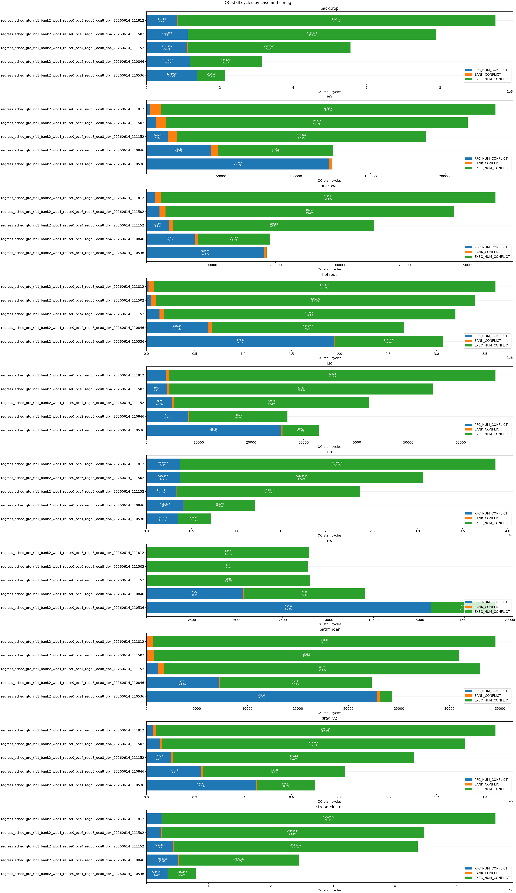
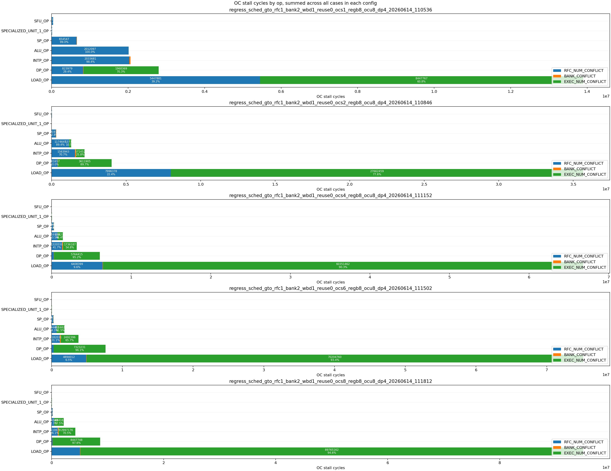
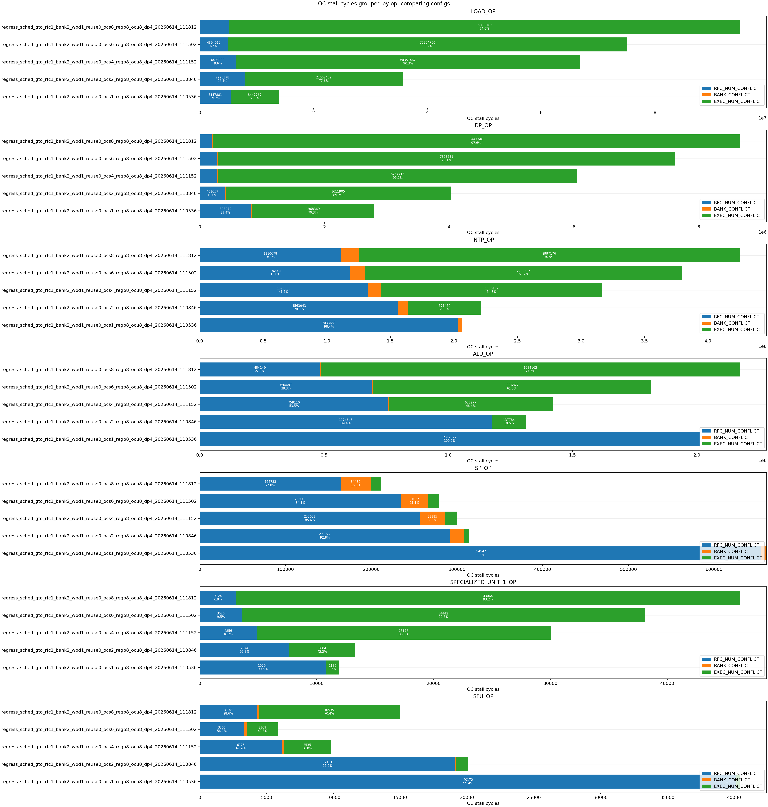

# 基于 Accel-Sim 的 RFC/Operand Collector 容量与下游执行瓶颈分析

## 摘要

本文基于 Accel-Sim/GPGPU-Sim，对 shader core 中 RFC 风格 operand-read buffer 的容量敏感性进行了建模与实验分析。实验围绕三个问题展开：第一，增加 RFC/operand collector entry 数量是否能够持续降低程序运行周期；第二，RFC/OC 阶段中不断累积的等待主要来自 entry 容量、register bank 访问，还是下游执行资源反压；第三，当等待集中在特定操作类型上时，增加对应执行单元能否验证瓶颈来源。

实验结果表明，RFC entry 数量从 `ocs=1` 增加到更大值后，整体性能只获得有限改善，10 个 Rodinia workload 的几何平均周期最低约为 `ocs=3` 附近，相对 `ocs=1` 降低约 2.45%。与此同时，`OPERAND_COLLECTOR` 阶段的 stall 占比从 22.06% 上升到 68.15%，remain 占比从 4.22% 上升到 15.74%。OC stall reason counter 显示，小 RFC 容量下存在真实的 RFC entry allocation bottleneck：`ocs=1` 时 `RFC_NUM_CONFLICT` 占 51.30%；但当 `ocs` 增加到 8 时，该比例下降到 6.39%，而 `EXEC_NUM_CONFLICT` 上升到 93.38%。这说明增加 RFC 容量可以缓解前端 entry allocation pressure，但会把等待暴露到下游执行、memory pipeline、output register 或 dispatch path。

进一步的 op-level 分析显示，`ocs=8` 下 `LOAD_OP` 贡献 87.17% 的 OC stall 和 86.08% 的 reason counter，`DP_OP` 贡献 8.15% 的 OC stall 和 7.85% 的 reason counter。DP unit sweep 进一步验证了 `DP_OP` 的下游执行瓶颈：在 `ocs=8` 下将 DP unit 从 4 增加到 12，可使 `DP_OP` 的 OC stall 降低 79.03%，并使 `hotspot`、`backprop`、`srad_v2` 的总周期分别降低 28.16%、19.17% 和 6.10%。相比之下，`streamcluster`、`nn` 等 load-heavy workload 对 DP unit 数量不敏感，说明其主要瓶颈更接近 memory/LSU/downstream path，而不是 DP execution pipeline。

**关键词**：Accel-Sim，GPGPU-Sim，Operand Collector，RFC，GPU 微结构，stall reason，Rodinia

---

## 1. 实验设计

### 1.1 研究目标

RFC 风格的 operand-read buffer 可以被理解为对传统 operand collector 的容量化扩展。增加 RFC/OC entry 数量后，更多已经被 scheduler 发射的指令可以进入 operand-read 相关结构中，从而减少前端因为无可用 entry 造成的阻塞。然而，RFC/OC entry 的增加并不必然带来线性加速，因为进入 RFC/OC 的指令最终仍需要消耗 register bank、执行流水线、load/store pipeline、output register 和 writeback path 等下游资源。

因此，本文重点分析以下三个问题：

1. RFC/OC entry 数量增加后，整体性能是否持续改善；
2. RFC/OC 阶段的等待主要来自 RFC entry 不足、bank conflict，还是下游执行资源反压；
3. 当等待集中在 `DP_OP` 或 `LOAD_OP` 等操作类型上时，能否通过 targeted resource sweep 验证瓶颈来源。

### 1.2 实验配置与派生数据

本文的结果来自三组参数扫描。原始 Accel-Sim 回归输出包含完整 trace、日志和中间统计文件，体积较大，不适合作为报告附件保存；因此本文只在当前目录保留复现实验结论所需的派生数据表和图片。报告中的图片位于同层目录 `graph/`，汇总数据位于同层目录 `csv/`。

三组扫描配置如下：

1. **RFC 容量 sweep**：固定 `sched=gto, rfc=1, bank=2, wbd=1, reuse=0, regb=8, ocu=8`，扫描 `ocs=1..8`。该组实验用于分析 RFC/OC entry 数量对总周期、stage-level remain/stall 和 op-level OC 压力的影响。
2. **DP unit sweep**：固定其余配置，扫描 `ocs={1,4,8}` 与 `dp={4,8,12}`。该组实验用于验证 `DP_OP` 在 OC/RFC 阶段的等待是否来自下游 DP execution throughput。
3. **OC stall reason sweep**：固定 `sched=gto, rfc=1, bank=2, wbd=1, reuse=0, regb=8, ocu=8, dp=4`，扫描 `ocs={1,2,4,6,8}`，统计 `RFC_NUM_CONFLICT`、`BANK_CONFLICT` 和 `EXEC_NUM_CONFLICT`。该组实验用于区分 entry allocation、register bank arbitration 和 downstream execution/memory backpressure。

为便于独立阅读和版本管理，本文使用的关键派生 CSV 包括：

| 文件 | 内容 |
|---|---|
| `csv/rfc_sweep_total_cycles.csv` | RFC 容量 sweep 的 workload 总周期 |
| `csv/rfc_sweep_geomean.csv` | RFC 容量 sweep 的几何平均归一化周期 |
| `csv/rfc_sweep_stage_remain_pct.csv` | RFC 容量 sweep 的 stage-level remain 占比 |
| `csv/rfc_sweep_stage_stall_pct.csv` | RFC 容量 sweep 的 stage-level stall 占比 |
| `csv/ocs8_oc_pressure_by_op.csv` | `ocs=8` 下不同 op 的 OC stall/remain 压力 |
| `csv/global_op_composition.csv` | 全局动态指令类型组成 |
| `csv/workload_op_composition.csv` | 各 workload 的动态指令类型组成 |
| `csv/oc_stall_reason_by_ocs.csv` | 不同 `ocs` 下的 OC stall reason 分布 |
| `csv/ocs8_oc_stall_reason_by_op.csv` | `ocs=8` 下按 op 聚合的 reason 分布 |
| `csv/ocs8_oc_stall_reason_by_case.csv` | `ocs=8` 下按 workload 聚合的 reason 分布 |
| `csv/ocs8_top_case_op_reason_counter.csv` | `ocs=8` 下最大的 case-op reason counter 组合 |
| `csv/dp_sweep_total_cycles.csv` | DP unit sweep 的 workload 总周期 |
| `csv/dp_sweep_ocs8_cycle_delta.csv` | `ocs=8` 下 DP unit sweep 的总周期变化 |
| `csv/dp_sweep_dp_op_oc_pressure.csv` | DP unit sweep 中 `DP_OP` 的 OC stall/remain 变化 |

对于多 kernel workload，本文使用每个 workload 日志中最后一次出现的 `gpu_tot_sim_cycle` 作为总模拟周期，并将该处理后的结果写入 `csv/rfc_sweep_total_cycles.csv`。

### 1.3 Workload 与指令类型组成

实验覆盖 10 个 Rodinia workload。根据派生数据 `csv/workload_op_composition.csv` 与 `csv/global_op_composition.csv`，全局指令类型分布如下：

| op | instruction count | 占比 |
|---|---:|---:|
| `LOAD_OP` | 1,186,916 | 39.45% |
| `INTP_OP` | 933,462 | 31.03% |
| `SP_OP` | 396,412 | 13.18% |
| `ALU_OP` | 353,699 | 11.76% |
| `DP_OP` | 99,476 | 3.31% |
| `SFU_OP` | 34,004 | 1.13% |
| `SPECIALIZED_UNIT_1_OP` | 4,346 | 0.14% |

不同 workload 的主导 op 类型存在明显差异：

| workload | 主要 op 组成 |
|---|---|
| `backprop` | `INTP_OP` 41.1%，`LOAD_OP` 24.7%，`ALU_OP` 22.1% |
| `bfs` | `INTP_OP` 77.2%，`LOAD_OP` 14.8%，`ALU_OP` 8.0% |
| `heartwall` | `INTP_OP` 72.8%，`ALU_OP` 12.9%，`LOAD_OP` 12.9% |
| `hotspot` | `INTP_OP` 32.3%，`ALU_OP` 19.7%，`LOAD_OP` 17.9% |
| `lud` | `LOAD_OP` 43.6%，`INTP_OP` 28.1%，`SP_OP` 21.9% |
| `nn` | `LOAD_OP` 49.9%，`INTP_OP` 24.8%，`SP_OP` 16.7% |
| `nw` | `INTP_OP` 52.4%，`LOAD_OP` 45.4%，`ALU_OP` 2.2% |
| `pathfinder` | `INTP_OP` 54.3%，`LOAD_OP` 32.9%，`ALU_OP` 12.8% |
| `srad_v2` | `INTP_OP` 37.2%，`LOAD_OP` 25.3%，`SP_OP` 20.4% |
| `streamcluster` | `LOAD_OP` 61.3%，`INTP_OP` 15.9%，`SP_OP` 15.0% |

该分布说明，虽然 `DP_OP` 在全局动态指令数中只占 3.31%，但它仍可能因为执行延迟长、pipeline 吞吐有限而形成显著 stall；同理，`LOAD_OP` 不仅数量最多，也更容易将 RFC/OC 等待与 memory/LSU 下游反压联系起来。

---

## 2. RFC 容量对性能的影响

### 2.1 总周期变化

表 1 给出了 `ocs=1..8` 下各 workload 的总模拟周期。整体来看，增加 RFC/OC entry 数量可以带来一定改善，但收益很快饱和，且不同 workload 的最优点并不一致。

| workload | ocs1 | ocs2 | ocs3 | ocs4 | ocs5 | ocs6 | ocs7 | ocs8 |
|---|---:|---:|---:|---:|---:|---:|---:|---:|
| `backprop` | 21,088 | 21,106 | 20,254 | 20,199 | 20,228 | 20,590 | 20,163 | 21,005 |
| `bfs` | 140,314 | 139,451 | 139,484 | 139,301 | 139,382 | 139,384 | 139,457 | 139,346 |
| `heartwall` | 11,273 | 10,571 | 10,593 | 10,749 | 10,620 | 10,680 | 10,727 | 10,664 |
| `hotspot` | 98,212 | 98,650 | 97,115 | 96,922 | 97,938 | 96,920 | 97,473 | 97,367 |
| `lud` | 171,869 | 166,733 | 166,596 | 166,321 | 166,600 | 166,325 | 166,486 | 166,428 |
| `nn` | 33,408 | 31,647 | 31,741 | 31,872 | 31,661 | 31,815 | 31,558 | 31,733 |
| `nw` | 141,446 | 139,356 | 138,806 | 138,631 | 138,839 | 138,627 | 138,610 | 138,624 |
| `pathfinder` | 35,439 | 35,007 | 35,129 | 34,957 | 35,032 | 35,006 | 34,940 | 35,006 |
| `srad_v2` | 36,262 | 35,868 | 35,577 | 35,547 | 35,476 | 35,580 | 35,634 | 35,620 |
| `streamcluster` | 1,118,972 | 1,119,725 | 1,119,753 | 1,129,283 | 1,121,965 | 1,119,603 | 1,121,706 | 1,127,871 |

以 `ocs=1` 为基准，几何平均归一化周期如下：

| ocs | geomean normalized cycle |
|---:|---:|
| 1 | 100.00% |
| 2 | 98.15% |
| 3 | 97.55% |
| 4 | 97.67% |
| 5 | 97.58% |
| 6 | 97.72% |
| 7 | 97.57% |
| 8 | 98.01% |

几何平均结果表明，RFC/OC entry 从 1 增加到 2 或 3 时能够释放一部分前端压力；但继续增加到 4 之后，整体收益不再扩大。`ocs=3` 的几何平均周期最低，为 `ocs=1` 的 97.55%，即整体改善约 2.45%。这一现象说明，RFC/OC entry 数量并不是唯一决定性能的因素。容量增加后，瓶颈会转移到其他资源，导致性能曲线快速饱和。

从单个 workload 看，`heartwall`、`nn`、`backprop` 的最优改善分别达到 6.23%、5.54% 和 4.39%；而 `streamcluster` 在所有更大 `ocs` 下均未优于 `ocs=1`。这说明 RFC 容量增大更有利于部分 compute/mixed workload，而对高度 load-dominated 的 workload 不一定有效。


### 2.2 Stage-level remain 与 stall 迁移

仅看总周期无法解释性能饱和原因，因此本文进一步分析 `SCHEDULER`、`OPERAND_COLLECTOR`、`EXECUTION_PIPELINE` 和 `WRITEBACK` 的 remain 与 stall 分布。

`remain` 统计显示，随着 `ocs` 增大，`OPERAND_COLLECTOR` 中累计驻留时间显著上升：

| ocs | SCHEDULER | OPERAND_COLLECTOR | EXECUTION_PIPELINE | WRITEBACK |
|---:|---:|---:|---:|---:|
| 1 | 10.79% | 4.22% | 84.73% | 0.27% |
| 2 | 11.63% | 7.22% | 80.88% | 0.27% |
| 3 | 11.39% | 9.41% | 78.95% | 0.26% |
| 4 | 11.65% | 11.96% | 76.13% | 0.26% |
| 5 | 11.51% | 12.29% | 75.94% | 0.26% |
| 6 | 11.61% | 13.03% | 75.11% | 0.26% |
| 7 | 11.78% | 14.57% | 73.40% | 0.25% |
| 8 | 11.25% | 15.74% | 72.76% | 0.25% |

`stall` 的迁移更加明显：

| ocs | SCHEDULER | OPERAND_COLLECTOR | WRITEBACK |
|---:|---:|---:|---:|
| 1 | 77.94% | 22.06% | 0.01% |
| 2 | 58.41% | 41.56% | 0.03% |
| 3 | 47.05% | 52.92% | 0.03% |
| 4 | 41.11% | 58.86% | 0.02% |
| 5 | 39.55% | 60.42% | 0.02% |
| 6 | 37.54% | 62.44% | 0.02% |
| 7 | 35.48% | 64.50% | 0.02% |
| 8 | 31.83% | 68.15% | 0.02% |

该结果说明，增加 RFC/OC entry 后，scheduler 前端的 stall 占比下降，更多指令进入 operand collector/RFC 相关结构，导致 OC 阶段成为更主要的等待暴露位置。换言之，RFC 容量增加并没有消除等待，而是改变了等待在流水线中的可见位置。


### 2.3 Op-level OC 压力来源

在 `ocs=8` 下，`OPERAND_COLLECTOR` 阶段的 stall 和 remain 均主要来自 `LOAD_OP`，其次为 `DP_OP`：

| op | OC stall | stall 占比 | OC remain | remain 占比 |
|---|---:|---:|---:|---:|
| `LOAD_OP` | 90.08M | 87.17% | 96.88M | 83.21% |
| `DP_OP` | 8.43M | 8.15% | 8.91M | 7.66% |
| `INTP_OP` | 2.94M | 2.84% | 6.30M | 5.41% |
| `ALU_OP` | 1.76M | 1.71% | 2.98M | 2.56% |
| `SP_OP` | 0.07M | 0.07% | 1.22M | 1.05% |
| `SPECIALIZED_UNIT_1_OP` | 0.05M | 0.04% | 0.06M | 0.05% |
| `SFU_OP` | 0.01M | 0.01% | 0.09M | 0.07% |

平均 OC remain cycle 也显示 `LOAD_OP` 和 `DP_OP` 对 `ocs` 增加更敏感：

| op | ocs1 | ocs2 | ocs4 | ocs6 | ocs8 |
|---|---:|---:|---:|---:|---:|
| `LOAD_OP` | 14.34 | 32.08 | 60.26 | 64.79 | 83.06 |
| `DP_OP` | 30.62 | 42.84 | 63.01 | 78.70 | 89.60 |
| `ALU_OP` | 7.77 | 5.71 | 6.14 | 7.21 | 8.42 |
| `INTP_OP` | 4.52 | 4.70 | 5.72 | 6.37 | 6.75 |
| `SP_OP` | 3.96 | 3.36 | 3.03 | 3.09 | 3.08 |

这表明，随着 RFC/OC entry 增加，`LOAD_OP` 和 `DP_OP` 是 OC/RFC 内驻留和等待增长的主要来源。`LOAD_OP` 的增长通常指向 memory/LSU/downstream path，`DP_OP` 的增长则更可能与长延迟 DP pipeline 或 DP execution throughput 相关。

---

## 3. OC stall reason 归因

### 3.1 Reason counter 定义

为了进一步区分 OC/RFC 阶段的等待来源，本文使用修正后的 OC stall reason counter。三个 reason 的含义如下：

```text
RFC_NUM_CONFLICT  : 没有空闲 RFC / collector entry，指令无法进入 OC/RFC；反映 entry allocation pressure
BANK_CONFLICT     : register bank read port 冲突；反映 operand fetch 期间的 bank arbitration pressure
EXEC_NUM_CONFLICT : operand 已经 ready，但无法 dispatch 到下游执行流水 / output register；反映下游执行或 memory path 反压
```

需要注意，reason counter 用于解释 RFC/OC 等待的来源，不等同于对原始 `OPERAND_COLLECTOR` stage stall 的严格加和分解。其价值在于判断等待是由 entry 容量、bank conflict 还是下游消化能力不足主导。

### 3.2 RFC 容量变化下的 reason 分布

按 10 个 workload 汇总，不同 `ocs` 下 reason counter 分布如下：

| ocs | total reason counter | RFC_NUM_CONFLICT | BANK_CONFLICT | EXEC_NUM_CONFLICT |
|---:|---:|---:|---:|---:|
| 1 | 21.49M | 11.02M / 51.30% | 0.047M / 0.22% | 10.42M / 48.48% |
| 2 | 43.57M | 11.46M / 26.29% | 0.113M / 0.26% | 32.00M / 73.45% |
| 4 | 77.78M | 9.03M / 11.61% | 0.194M / 0.25% | 68.55M / 88.14% |
| 6 | 88.70M | 7.29M / 8.22% | 0.224M / 0.25% | 81.19M / 91.53% |
| 8 | 110.26M | 7.04M / 6.39% | 0.255M / 0.23% | 102.96M / 93.38% |

该结果给出了 RFC sweep 的核心解释：

- 当 `ocs=1` 时，`RFC_NUM_CONFLICT` 占 51.30%，说明小容量 RFC/OC 确实存在 entry allocation bottleneck；
- 当 `ocs` 增加时，`RFC_NUM_CONFLICT` 占比快速下降，到 `ocs=8` 时只剩 6.39%；
- `EXEC_NUM_CONFLICT` 占比从 48.48% 上升到 93.38%，说明 entry pressure 缓解后，主要等待转移到下游执行、memory pipeline、output register 或 dispatch path；
- `BANK_CONFLICT` 始终约为 0.22%~0.26%，在当前配置中不是全局主导瓶颈。





### 3.3 Op-level reason 分布

`ocs=8` 下的 op-level reason counter 如下：

| op | total reason counter | RFC_NUM_CONFLICT | BANK_CONFLICT | EXEC_NUM_CONFLICT |
|---|---:|---:|---:|---:|
| `LOAD_OP` | 94.91M | 5.35% | 0.06% | 94.58% |
| `DP_OP` | 8.66M | 2.25% | 0.17% | 97.59% |
| `INTP_OP` | 4.25M | 26.14% | 3.33% | 70.53% |
| `ALU_OP` | 2.17M | 22.28% | 0.20% | 77.52% |
| `SP_OP` | 0.21M | 77.84% | 16.29% | 5.86% |
| `SPECIALIZED_UNIT_1_OP` | 0.05M | 6.76% | 0.00% | 93.24% |
| `SFU_OP` | 0.01M | 28.59% | 0.99% | 70.42% |

`LOAD_OP` 和 `DP_OP` 合计贡献了 `ocs=8` 下 93.93% 的全局 reason counter，且两者都由 `EXEC_NUM_CONFLICT` 主导。`INTP_OP`、`ALU_OP` 和 `SP_OP` 的 `RFC_NUM_CONFLICT` 占比更高，但绝对量远小于 `LOAD_OP` 与 `DP_OP`。因此，全局性能瓶颈不应简单归因于 bank conflict 或普通 ALU/INTP 操作的 entry contention，而应重点关注 `LOAD_OP` 和 `DP_OP` 对下游资源的压力。




### 3.4 Case-level reason 分布

`ocs=8` 下，不同 workload 的 reason counter 分布如下：

| workload | total reason counter | RFC_NUM_CONFLICT | BANK_CONFLICT | EXEC_NUM_CONFLICT |
|---|---:|---:|---:|---:|
| `streamcluster` | 56.17M | 4.36% | 0.21% | 95.43% |
| `nn` | 38.64M | 9.55% | 0.11% | 90.34% |
| `backprop` | 9.51M | 8.78% | 0.13% | 91.10% |
| `hotspot` | 3.61M | 0.59% | 1.49% | 97.92% |
| `srad_v2` | 1.44M | 1.91% | 0.77% | 97.33% |
| `heartwall` | 0.54M | 2.43% | 1.77% | 95.80% |
| `bfs` | 0.23M | 1.01% | 3.06% | 95.93% |
| `lud` | 0.07M | 5.69% | 0.85% | 93.46% |
| `pathfinder` | 0.03M | 0.02% | 1.86% | 98.12% |
| `nw` | 0.01M | 0.00% | 0.31% | 99.69% |

最大的 case-op 组合进一步说明了主要压力来源：

| rank | case-op | reason counter |
|---:|---|---:|
| 1 | `streamcluster` / `LOAD_OP` | 54.44M |
| 2 | `nn` / `LOAD_OP` | 37.71M |
| 3 | `backprop` / `DP_OP` | 5.91M |
| 4 | `hotspot` / `DP_OP` | 2.37M |
| 5 | `backprop` / `LOAD_OP` | 1.52M |
| 6 | `backprop` / `ALU_OP` | 1.08M |
| 7 | `streamcluster` / `INTP_OP` | 1.07M |

`streamcluster` 和 `nn` 的 reason counter 主要由 `LOAD_OP` 构成，说明它们的 OC/RFC 等待更接近 memory/LSU/downstream path。`backprop` 和 `hotspot` 的主要 case-op 来源是 `DP_OP`，因此更适合通过 DP execution resource sweep 来验证。

---

## 4. DP Unit Sweep：对 DP-sensitive 瓶颈的验证

### 4.1 总周期响应

DP unit sweep 使用 `ocs={1,4,8}` 与 `dp={4,8,12}`。表 2 给出了各 workload 在 `ocs=8` 下相对 `dp=4` 的总周期变化。

| workload | dp8 vs dp4 | dp12 vs dp4 | 最优变化 |
|---|---:|---:|---:|
| `hotspot` | -22.58% | -28.16% | -28.16% |
| `backprop` | -14.58% | -19.17% | -19.17% |
| `srad_v2` | -6.05% | -6.10% | -6.10% |
| `bfs` | 0.00% | 0.00% | 0.00% |
| `heartwall` | 0.00% | 0.00% | 0.00% |
| `lud` | 0.00% | 0.00% | 0.00% |
| `nn` | 0.00% | 0.00% | 0.00% |
| `nw` | 0.00% | 0.00% | 0.00% |
| `pathfinder` | 0.00% | 0.00% | 0.00% |
| `streamcluster` | 0.00% | 0.00% | 0.00% |

`hotspot`、`backprop` 和 `srad_v2` 对 DP unit 数量敏感，其余 workload 几乎不受影响。该结果说明 DP execution resource 不是所有 workload 的全局瓶颈，而是集中影响 DP-sensitive workload。


### 4.2 DP_OP OC stall/remain 变化

DP unit 增加后，`DP_OP` 在 OC 阶段的 stall 与 remain 显著下降：

| ocs | dp | DP_OP OC stall | stall 相对 dp4 | DP_OP OC remain | remain 相对 dp4 |
|---:|---:|---:|---:|---:|---:|
| 1 | 4 | 1.94M | 0.00% | 3.05M | 0.00% |
| 1 | 8 | 0.49M | -74.71% | 1.02M | -66.42% |
| 1 | 12 | 0.18M | -90.55% | 0.62M | -79.56% |
| 4 | 4 | 5.71M | 0.00% | 6.27M | 0.00% |
| 4 | 8 | 1.85M | -67.50% | 2.29M | -63.52% |
| 4 | 12 | 1.00M | -82.41% | 1.39M | -77.85% |
| 8 | 4 | 8.43M | 0.00% | 8.91M | 0.00% |
| 8 | 8 | 3.25M | -61.38% | 3.63M | -59.23% |
| 8 | 12 | 1.77M | -79.03% | 2.10M | -76.47% |

在 `ocs=8` 下，DP unit 从 4 增加到 12 后，`DP_OP` 的 OC stall 从 8.43M 降到 1.77M，remain 从 8.91M 降到 2.10M。这直接支持了 reason counter 的解释：`DP_OP` 在 RFC/OC 中的等待主要不是 bank conflict，而是 operand ready 后无法被下游 DP execution pipeline 及时消化。


### 4.3 DP-sensitive 与 load-sensitive workload 的区别

DP sweep 的结果可以将 workload 分为两类：

1. **DP-sensitive workload**：`hotspot`、`backprop`、`srad_v2`。这些 workload 的总周期随 DP unit 增加明显下降，且 `DP_OP` 的 OC stall/remain 同步下降，说明 DP execution throughput 是其主要限制之一。
2. **load/downstream-sensitive workload**：`streamcluster`、`nn` 以及部分 memory-heavy workload。这些 workload 即使增加 DP unit，总周期也不变化；结合 reason counter 中 `LOAD_OP` 的主导地位，可以推断其等待主要来自 memory/LSU/downstream path，而不是 DP pipeline。

该分类解释了为什么单纯增加 RFC/OC entry 不能持续提升性能：对于 DP-sensitive workload，RFC 增大后会把更多 `DP_OP` 推到 DP execution bottleneck 前；对于 load-sensitive workload，RFC 增大后会把更多 `LOAD_OP` 推到 memory/LSU/downstream bottleneck 前。两类 workload 的下游瓶颈不同，但都表现为 OC/RFC 内 `EXEC_NUM_CONFLICT` 上升。

---

## 5. 讨论

### 5.1 RFC 容量增加的作用边界

RFC/OC entry 数量增加的直接作用是降低 entry allocation pressure。reason counter 显示，`RFC_NUM_CONFLICT` 从 `ocs=1` 的 51.30% 下降到 `ocs=8` 的 6.39%，说明容量扩展确实有效缓解了小容量下的结构性阻塞。然而，总周期并没有随着 `ocs` 继续增加而持续降低，说明系统在 entry pressure 缓解后很快受到其他资源限制。

这一点也可以从 stage-level stall 迁移中观察到：`SCHEDULER` stall 占比从 77.94% 降到 31.83%，而 `OPERAND_COLLECTOR` stall 占比从 22.06% 升到 68.15%。因此，RFC/OC entry 增加更像是改变了 bottleneck 的暴露位置，而不是单独移除了瓶颈。

### 5.2 Bank conflict 不是当前配置的主导问题

在所有 `ocs` 配置下，`BANK_CONFLICT` 占比都稳定在约 0.22%~0.26%。虽然 `SP_OP` 自身的 bank conflict 占比较高，但其绝对 reason counter 只有 0.21M，占全局不足 0.2%。因此，在当前 workload 与配置组合下，register bank conflict 不是主要性能限制。

这并不意味着 bank conflict 在所有 GPU 配置中都不重要，而是说明在本文配置下，bank conflict 被更强的下游执行/memory 反压所掩盖。若后续改变 bank 数量、warp scheduler 策略或 operand reuse 策略，bank conflict 的重要性仍可能变化。

### 5.3 LOAD_OP 与 DP_OP 的不同含义

`LOAD_OP` 和 `DP_OP` 都在 `ocs=8` 下表现为 `EXEC_NUM_CONFLICT` 主导，但二者含义不同：

- `LOAD_OP` 的 `EXEC_NUM_CONFLICT` 更可能对应 LSU、memory pipeline、memory dependency 或 downstream dispatch/output path；
- `DP_OP` 的 `EXEC_NUM_CONFLICT` 更直接对应 DP execution pipeline throughput。

DP unit sweep 已经验证了第二点：增加 DP unit 能显著降低 `DP_OP` OC stall/remain，并改善 `hotspot` 和 `backprop` 的总周期。对于 `LOAD_OP`，还需要进一步拆分 LSU queue、memory pipeline、output register 和 result bus 等下游资源，才能更精确定位 `LOAD_OP` 的 `EXEC_NUM_CONFLICT` 来源。

---

## 6. 后续工作

本文已经能够区分 `RFC_NUM_CONFLICT`、`BANK_CONFLICT` 和 `EXEC_NUM_CONFLICT`，后续工作的重点应放在进一步拆分 `EXEC_NUM_CONFLICT`。建议增加以下统计：

```text
per-op EXEC_NUM_CONFLICT: LSU / memory pipeline busy
per-op EXEC_NUM_CONFLICT: DP/SP/SFU execution pipeline busy
per-op EXEC_NUM_CONFLICT: output register / result bus busy
per-op RFC_NUM_CONFLICT: per scheduler / per RFC entry occupancy
per-op BANK_CONFLICT: bank id distribution and conflict degree
```

这些统计可以进一步回答：

- `LOAD_OP` 的等待主要来自 LSU queue、memory pipeline，还是 output path；
- `DP_OP` 的等待是否完全由 DP execution unit 数量解释；
- `nn` 在 `ocs=8` 下仍有 9.55% `RFC_NUM_CONFLICT`，是否说明部分 load-heavy workload 仍受 RFC entry 数量影响；
- operand reuse hint、bank 数量和 scheduler policy 是否会改变 `BANK_CONFLICT` 的重要性。

---

## 7. 结论

本文通过 RFC capacity sweep、OC stall reason counter 和 DP unit sweep，对 Accel-Sim/GPGPU-Sim 中 RFC/operand collector 风格结构的瓶颈迁移进行了系统分析。实验表明：

1. RFC/OC entry 数量增加可以缓解小容量下的 entry allocation bottleneck，但整体性能收益有限，10 个 workload 的几何平均周期最低为 `ocs=3`，约为 `ocs=1` 的 97.55%；
2. stage-level 统计显示，随着 `ocs` 增大，stall 从 scheduler 前端迁移到 operand collector/RFC 阶段，`OPERAND_COLLECTOR` stall 占比从 22.06% 上升到 68.15%；
3. OC stall reason counter 显示，`RFC_NUM_CONFLICT` 从 `ocs=1` 的 51.30% 降到 `ocs=8` 的 6.39%，而 `EXEC_NUM_CONFLICT` 从 48.48% 上升到 93.38%，说明主导瓶颈从 entry allocation pressure 转向下游执行或 memory path 反压；
4. `LOAD_OP` 和 `DP_OP` 是 OC/RFC 等待的主要来源，其中 `LOAD_OP` 更接近 memory/LSU/downstream bottleneck，`DP_OP` 更接近 DP execution pipeline bottleneck；
5. DP unit sweep 验证了 `DP_OP` 瓶颈归因：在 `ocs=8` 下将 DP unit 从 4 增至 12，使 `DP_OP` OC stall 降低 79.03%，并使 `hotspot`、`backprop` 和 `srad_v2` 分别获得 28.16%、19.17% 和 6.10% 的总周期改善。

因此，RFC/OC 容量优化必须与下游执行资源、memory/LSU path、output register 和 dispatch 能力协同考虑。单独增加 RFC entry 可以减少小容量下的结构冲突，但当下游资源不能同步扩展时，更多进入 RFC/OC 的指令会转化为 `EXEC_NUM_CONFLICT`，从而导致性能收益快速饱和。
