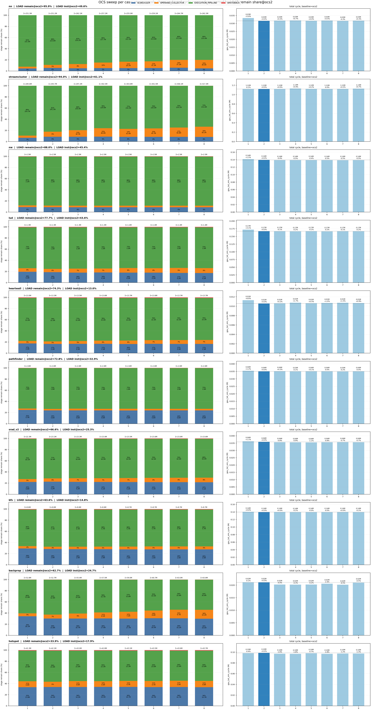
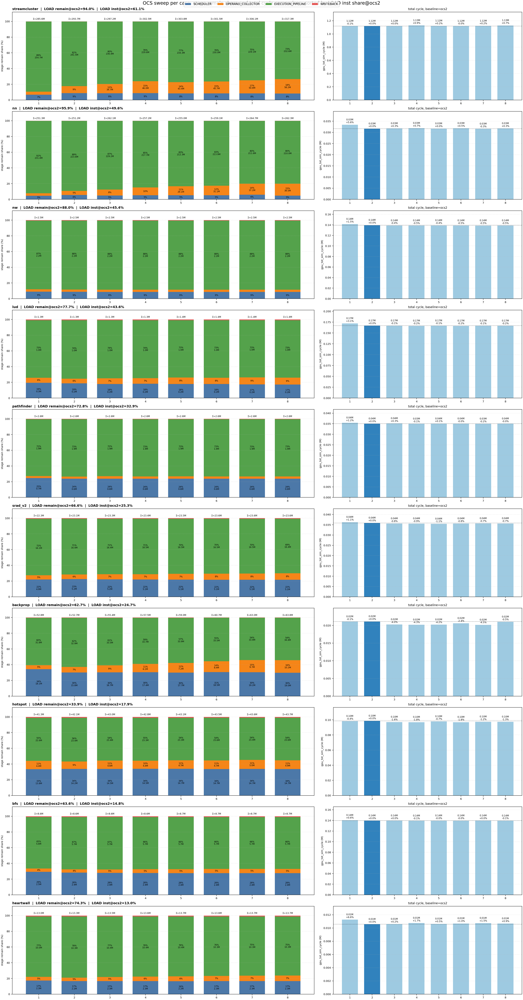
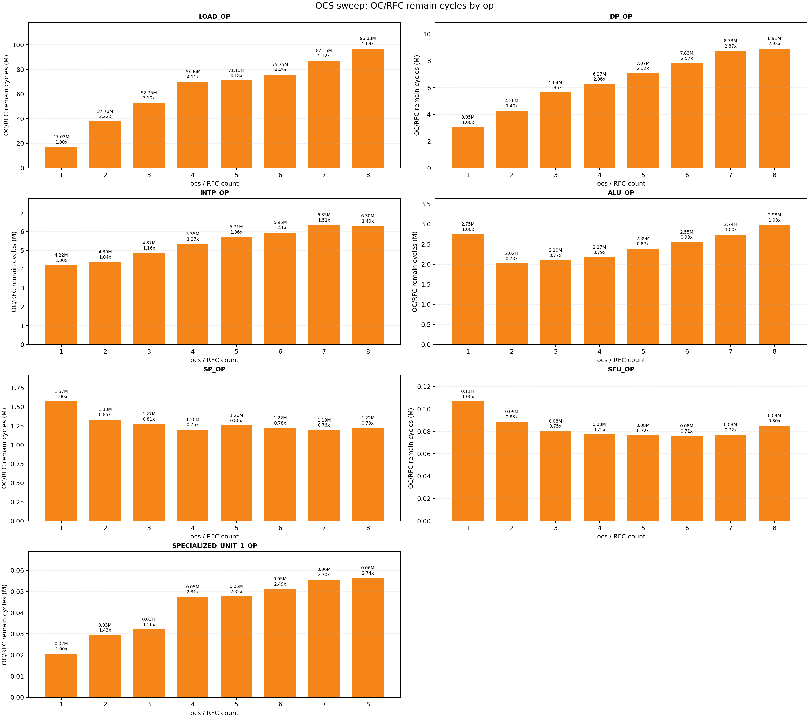
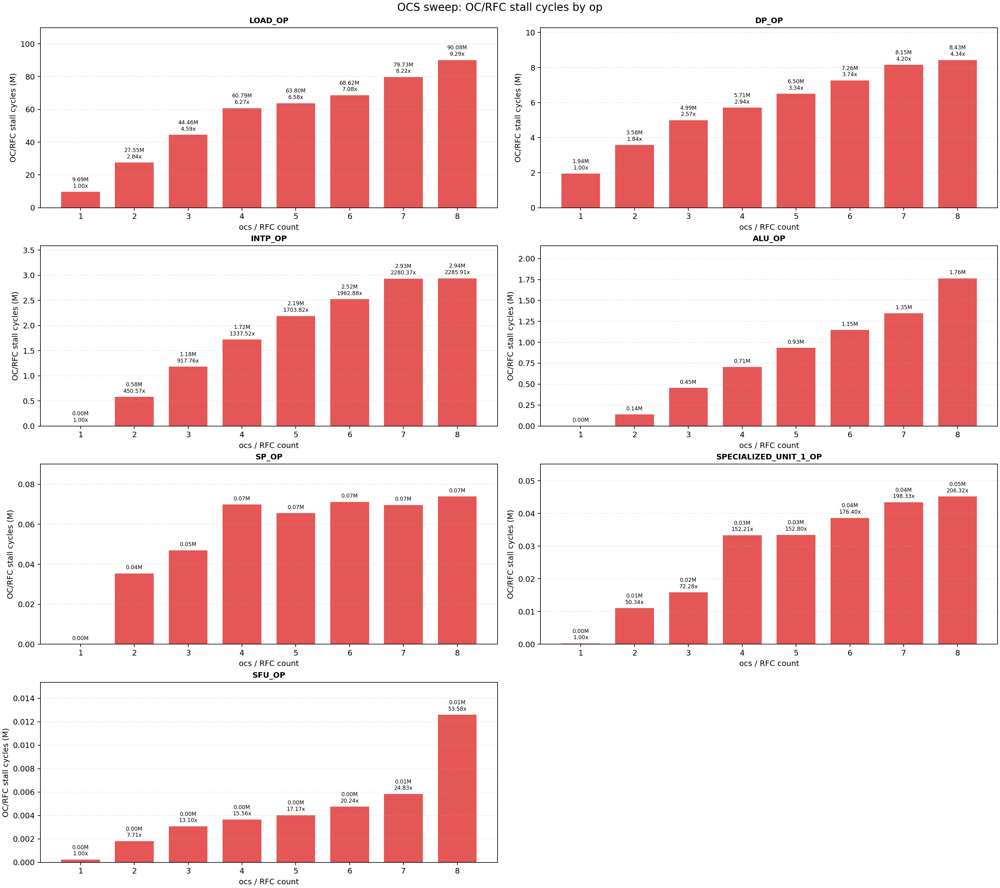
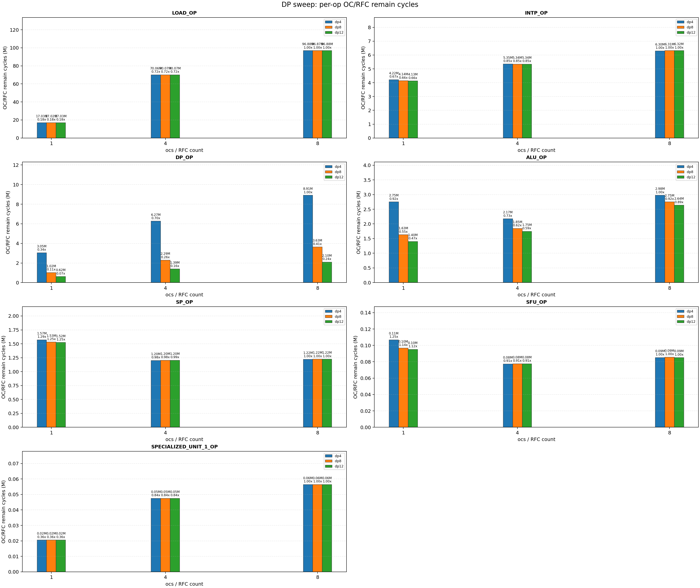
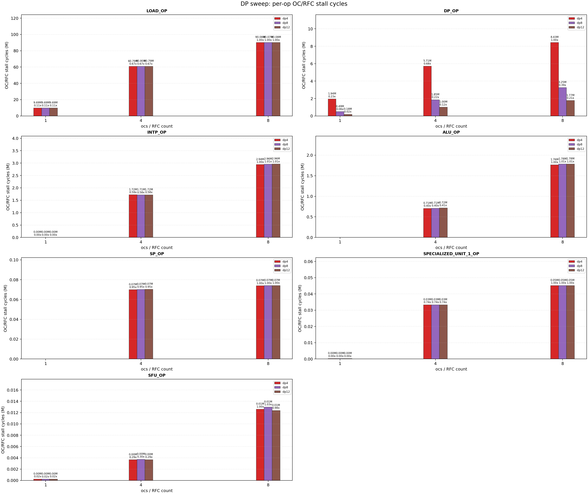
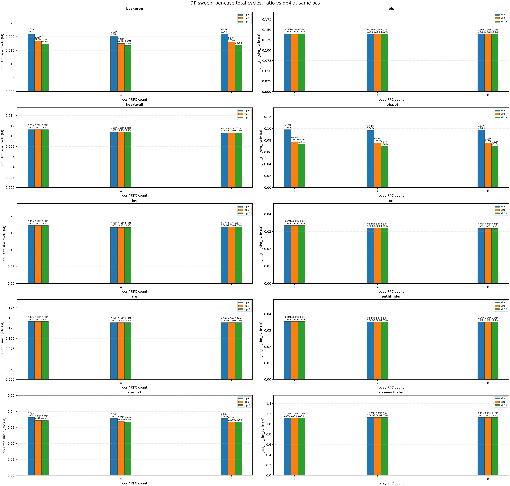

# RFC 数量 Sweep 与 DP Unit 验证实验分析

本文档总结两个相关实验：

1. **RFC 数量 sweep**：固定其他参数，改变 RFC / OCS 数量，观察性能与 pipeline stage 瓶颈变化。
2. **DP unit sweep 验证实验**：在 RFC/OC 阶段发现 `DP_OP` 明显堆积后，增加 DP 执行单元数量，验证是否存在下游 DP execution resource backpressure。

核心结论：

> RFC 数量增加并不会持续带来性能提升。它主要把阻塞从 scheduler / 前端推进到 RFC / operand-read 阶段。当 RFC 数量足够后，真正决定性能的是下游资源，例如 memory path、DP execution pipeline、bank arbitration 或 output port。DP unit sweep 进一步验证了 `backprop`、`hotspot` 和部分 `srad_v2` 的性能瓶颈确实与 DP execution resource 相关。

---

## 1. 实验路径

### 1.1 RFC 数量 sweep

结果目录：

```text
/Users/bytedance/Desktop/Accel-sim/accel-sim-framework/regress_result/20260610_013512
```

主要配置：

```text
scheduler = gto
rfc = enabled
bank = 2
writeback_depth = 1
reuse = 0
ocs / rfc_num = 1 ~ 8
reg_bank = 8
ocu = 8
```

本实验中，`ocs` 可以理解为 RFC/OC 相关数量参数。

### 1.2 DP unit sweep

结果目录：

```text
/Users/bytedance/Desktop/Accel-sim/accel-sim-framework/regress_result/20260612_064245
```

主要配置：

```text
ocs = 1 / 4 / 8
dp unit = 4 / 8 / 12
其他参数保持一致
```

该实验用于验证：RFC/OC 阶段中的 `DP_OP` 堆积是否来自下游 DP 执行资源不足。

---

## 2. 相关图片

### 2.1 RFC sweep：按 LOAD remain 占比排序的 case-stage 图



### 2.2 RFC sweep：按 LOAD 指令数量占比排序的 case-stage 图



### 2.3 RFC sweep：不同 op 的 OC/RFC remain cycles



### 2.4 RFC sweep：不同 op 的 OC/RFC stall cycles



### 2.5 DP unit sweep：不同 op 的 OC/RFC remain cycles



### 2.6 DP unit sweep：不同 op 的 OC/RFC stall cycles



### 2.7 DP unit sweep：不同 case 的总 cycle 对比



---

## 3. RFC 数量 sweep 的主要结果

### 3.1 总周期：从 ocs=2 之后基本饱和

以 `ocs=2` 为 baseline，统计 10 个 case 的 `gpu_tot_sim_cycle`：

| ocs | 平均变化 | 中位数变化 | 最小值 | 最大值 |
|---:|---:|---:|---:|---:|
| 1 | +1.91% | +1.17% | -0.44% | +6.64% |
| 2 | 0.00% | 0.00% | 0.00% | 0.00% |
| 3 | -0.60% | -0.04% | -4.04% | +0.35% |
| 4 | -0.47% | -0.19% | -4.30% | +1.68% |
| 5 | -0.57% | -0.06% | -4.16% | +0.46% |
| 6 | -0.43% | -0.15% | -2.44% | +1.03% |
| 7 | -0.58% | -0.24% | -4.47% | +1.48% |
| 8 | -0.14% | -0.13% | -1.30% | +0.88% |

这个结果说明：

- `ocs=1` 相比 `ocs=2` 略差，说明 RFC 数量太小时确实可能限制前端推进。
- 从 `ocs=2` 开始，继续增加到 `ocs=4/8` 后，总周期基本饱和。
- **RFC 数量增加到一定程度后，瓶颈转移到下游资源，RFC 容量不再是主瓶颈。**

### 3.2 ocs8 相比 ocs2 的 case-level 总周期变化

| case | ocs2 cycle | ocs8 cycle | 变化 |
|---|---:|---:|---:|
| `hotspot` | 98,650 | 97,367 | -1.30% |
| `srad_v2` | 35,868 | 35,620 | -0.69% |
| `nw` | 139,356 | 138,624 | -0.53% |
| `backprop` | 21,106 | 21,005 | -0.48% |
| `lud` | 166,733 | 166,428 | -0.18% |
| `bfs` | 139,451 | 139,346 | -0.08% |
| `pathfinder` | 35,007 | 35,006 | -0.00% |
| `nn` | 31,647 | 31,733 | +0.27% |
| `streamcluster` | 1,119,725 | 1,127,871 | +0.73% |
| `heartwall` | 10,571 | 10,664 | +0.88% |

可以看到，`ocs=8` 相比 `ocs=2` 的改善非常有限，绝大多数 case 在 ±1% 左右。因此 RFC sweep 更适合用来分析**瓶颈位置转移**。

---

## 4. RFC/OC 阶段为什么随 RFC 数量增加而上升

实验中可以观察到，随着 `ocs / rfc_num` 增加，`OPERAND_COLLECTOR` 阶段的 remain/stall 占比上升。

这里需要注意：在本项目修改后，图里的 `OPERAND_COLLECTOR` 更应该理解为：

```text
RFC / operand-read / register-read 等待阶段
```

它不完全等价于原始 GPGPU-Sim 中按 FU 类型划分的 operand collector 结构。

正确解释是：

> RFC 数量增加后，更多指令可以更早离开 scheduler，进入 RFC/OC 阶段。原本停在 scheduler 或前端的等待，被推进并暴露到 RFC/operand-read 阶段。如果下游执行单元、memory path、bank read、output port 或 writeback 资源没有同步增强，指令仍然会在 RFC/OC 阶段等待。因此 OC/RFC remain 和 stall 上升并不一定代表 RFC 本身变慢，而是代表瓶颈位置发生转移。

---

## 5. RFC sweep 的 op-level 证据

从 `ocs=2` 到 `ocs=8`，各 op 在 `OPERAND_COLLECTOR` / RFC 阶段的 remain cycles 变化如下：

| op | ocs2 OC/RFC remain | ocs8 OC/RFC remain | ocs8 stall/remain |
|---|---:|---:|---:|
| `LOAD_OP` | 37.78M | 96.88M | 93.0% |
| `DP_OP` | 4.26M | 8.91M | 94.6% |
| `INTP_OP` | 4.39M | 6.30M | 46.7% |
| `ALU_OP` | 2.02M | 2.98M | 59.3% |
| `SP_OP` | 1.33M | 1.22M | 6.0% |
| `SFU_OP` | 0.09M | 0.09M | 14.8% |
| `SPECIALIZED_UNIT_1_OP` | 0.03M | 0.06M | 80.1% |

这里最重要的现象是：

1. `LOAD_OP` 是 RFC/OC 阶段最大的 cycle 来源。
2. `DP_OP` 虽然总量小于 `LOAD_OP`，但 `stall/remain` 很高，达到 94.6%。
3. `SP_OP` 和 `SFU_OP` 的 stall/remain 明显较低，说明普通或较快执行路径不是主要瓶颈。
4. `SPECIALIZED_UNIT_1_OP` 的 stall/remain 很高，但绝对 cycle 较小，因此不应被夸大为全局瓶颈。

因此，RFC sweep 后的判断是：

> RFC/OC 阶段的主要压力来自 `LOAD_OP` 和 `DP_OP`。其中 `LOAD_OP` 更可能对应 memory path / memory latency / memory bandwidth 问题；`DP_OP` 更可能对应长延迟执行单元或 DP pipeline backpressure。

---

## 6. workload 分类与 case-level 理解

结合 `case_classification.updated.md`，不能只用 `LOAD_OP` 数量简单判断 workload 类型：

- 先看 `LOAD_OP` remain 和 LOAD 指令数量占比；
- 再看 `DP_OP`、`ALU_OP`、`SP_OP` 等 compute 类 op 的 RFC/OC remain/stall；
- 最后结合 trace 中 SASS opcode 或访存类型，区分 global load、shared/local load、address-heavy 和 compute-sensitive workload。

基于当前实验，可以粗略分为：

### 6.1 Memory-dominated / load-heavy case

```text
streamcluster
nn
nw
lud
pathfinder
bfs
heartwall
```

这些 case 中，RFC 数量增加后总周期变化通常较小。原因是主瓶颈更可能在 memory path，而不是 RFC 容量。

### 6.2 Compute / DP-sensitive case

```text
backprop
hotspot
srad_v2
```

这三个 case 在 DP unit sweep 中表现出不同程度的性能敏感性。其中：

- `hotspot` 最明显；
- `backprop` 很明显；
- `srad_v2` 有一定瓶颈，但不如前两者严重。

---

## 7. DP unit sweep 验证实验

RFC sweep 发现 `DP_OP` 在 RFC/OC 阶段存在明显堆积。为了验证这是否来自下游 DP execution resource backpressure，进一步进行了 DP unit 数量 sweep。

### 7.1 总体性能变化

相对同一 `ocs` 下的 `dp4`：

| 配置 | 平均变化 | 中位数变化 |
|---|---:|---:|
| ocs1 dp8 | -3.89% | 0.00% |
| ocs1 dp12 | -4.75% | 0.00% |
| ocs4 dp8 | -4.04% | 0.00% |
| ocs4 dp12 | -5.01% | 0.00% |
| ocs8 dp8 | -4.32% | 0.00% |
| ocs8 dp12 | -5.34% | 0.00% |

注意中位数是 0%，说明大多数 case 对 DP unit 数量不敏感，平均收益主要来自少数 DP-sensitive workload。

### 7.2 ocs8 下 dp12 相比 dp4 的 case-level 变化

| case | ocs8 dp4 cycle | ocs8 dp12 cycle | 变化 |
|---|---:|---:|---:|
| `hotspot` | 97,367 | 69,949 | -28.16% |
| `backprop` | 21,005 | 16,979 | -19.17% |
| `srad_v2` | 35,620 | 33,447 | -6.10% |
| `bfs` | 139,346 | 139,346 | 0.00% |
| `heartwall` | 10,664 | 10,664 | 0.00% |
| `lud` | 166,428 | 166,428 | 0.00% |
| `nn` | 31,733 | 31,733 | 0.00% |
| `nw` | 138,624 | 138,624 | 0.00% |
| `pathfinder` | 35,006 | 35,006 | 0.00% |
| `streamcluster` | 1,127,871 | 1,127,871 | 0.00% |

这个结果非常关键：

> 增加 DP unit 只显著改善 `hotspot`、`backprop` 和部分 `srad_v2`，对 load-heavy case 基本没有影响。


### 7.3 DP_OP 的 OC/RFC remain 和 stall 显著下降

在 `ocs=8` 下：

| DP unit | DP_OP OC/RFC remain | DP_OP OC/RFC stall | stall/remain |
|---:|---:|---:|---:|
| dp4 | 8.91M | 8.43M | 94.6% |
| dp8 | 3.63M | 3.25M | 89.6% |
| dp12 | 2.10M | 1.77M | 84.2% |

从 `dp4` 到 `dp12`：

```text
DP_OP OC/RFC remain 下降约 76.5%
DP_OP OC/RFC stall 下降约 79.0%
```

这直接支持如下结论：

> `DP_OP` 在 RFC/OC 阶段的堆积很大程度来自下游 DP execution pipeline 吞吐不足。增加 DP unit 后，DP_OP 等待下游资源的时间显著减少，对 DP-sensitive workload 的总周期也明显下降。

---

## 8. 两个实验合起来的因果链

1. **结构修改**：将原 operand collector 路径改造成 RFC 风格的统一 operand-read buffer。
2. **现象观察**：RFC 数量增加后，总周期很快饱和，但 RFC/OC stage 的 remain 和 stall 占比上升。
3. **初步判断**：RFC 数量增加并没有消除瓶颈，而是把瓶颈从 scheduler/前端推进到了 RFC/operand-read 阶段。
4. **op-level 拆解**：`LOAD_OP` 和 `DP_OP` 是 RFC/OC 阶段主要压力来源。
5. **workload 分类**：load-heavy case 主要受 memory path 影响；`backprop`、`hotspot`、`srad_v2` 对 DP execution resource 更敏感。
6. **验证实验**：增加 DP unit 数量。
7. **验证结果**：DP_OP 的 RFC/OC remain/stall 大幅下降，`hotspot` 和 `backprop` 总周期明显改善，而 load-heavy case 基本不变。
8. **最终结论**：RFC 容量需要和下游执行资源、memory path、bank arbitration 能力匹配。单纯增加 RFC 数量只会改变瓶颈暴露位置，不一定带来持续性能收益。

---

## 9. 后续工作：进一步区分 stall reason

当前 remain/stall 统计已经能定位到 op 和 stage，但还不能完全区分 stall reason。后续可以增加更细粒度的统计项：

```text
per-op RFC stall: bank conflict
per-op RFC stall: FU/output busy
per-op RFC stall: operand not ready
per-op RFC stall: RFC queue full
per-op RFC stall: writeback/result-bus busy
```

有了这些 counter 后，可以进一步区分：

- `LOAD_OP` 是 memory latency、bank conflict，还是 memory pipeline backpressure；
- `DP_OP` 是 DP FU busy，还是 operand-read/bank conflict；
- 普通 `SP_OP` / `SFU_OP` 是否真的不受 RFC 数量影响。

---

## 10. 项目总结

> 这是一个基于 Accel-Sim/GPGPU-Sim 的 shader core RFC/operand-read 微结构建模与瓶颈归因项目：通过修改 operand collector 路径、增加 per-op/per-stage remain 与 stall 统计，发现 RFC 容量增加会把瓶颈从 scheduler 前端转移到 RFC/OC 阶段；进一步通过 DP unit sweep 验证了 `backprop` 和 `hotspot` 的主要瓶颈来自 DP execution resource backpressure，而 memory-heavy workload 则主要受 memory path 限制。
